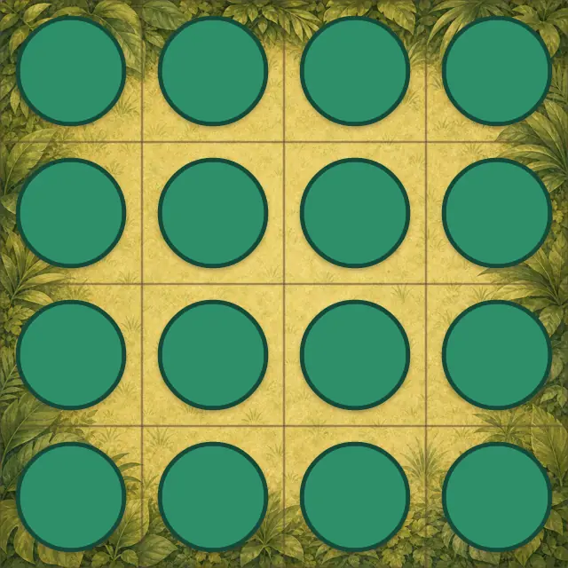

# MistyFlipJungle

[](https://github.com/brianhliou/misty-flip-jungle/actions/workflows/ci.yml)
[](https://github.com/brianhliou/misty-flip-jungle/releases/latest)
[](LICENSE)

A Flip Jungle (翻翻棋, hidden-identity animal chess) engine in Rust: alpha-beta with Star1
chance-node pruning, a transposition table, quiescence, and killer/history move ordering, plus
exact retrograde-analysis endgame tablebases that store distance-to-mate, so the engine finishes a
won endgame by the shortest forced line instead of holding it forever. No neural network. The
search core is exposed to Python via PyO3, and the tablebase builder ships as a standalone binary.

Flip Jungle is a 4×4 game: sixteen animals, eight a side, all face-down at the start. On your turn
you flip a tile to reveal a random animal or move a face-up animal one square. Captures go by rank,
with two twists: the rat captures the elephant, and two animals of equal rank trade off together.
Hidden identities make each flip a chance event, so the search is expectiminimax (Star1).

<p align="center">
  <a href="https://mistboard.com/?play=computer&gameSpecId=jungle-flip">
    
  </a>
  <br>
  <sub><i>MistyFlipJungle self-play: tiles flip to reveal animals, the lions and elephants trade off (同归于尽), and Black wins.</i></sub>
</p>

**Play it** against the computer on
[mistboard.com](https://mistboard.com/?play=computer&gameSpecId=jungle-flip), where this engine is
the Flip Jungle opponent ([rules](https://mistboard.com/rules/jungle-flip)).

## Strength

Near-perfect where it can be checked: on solvable endgames (up to five pieces) it matches the exact
tablebase 99 to 100% of the time, and it agreed with a forward solver on all 200 midgame test
positions. The opening, where the flips happen, is too large to solve, so play there is unverified.

The build story, including what a near-perfect engine says about the game's skill ceiling, is on my
blog: [Building a Flip Jungle Engine](https://brianhliou.com/posts/building-flip-jungle-engine/).

## Build

The tablebase builder is pure Rust (no Python):

```bash
cargo build --release --no-default-features --bin build_tb
./target/release/build_tb <max_pieces> [out.bin]
```

It solves every position up to `<max_pieces>` by parallel retrograde analysis and writes a flat
table (two result bits plus one distance byte per position). The UCI engine loads a prebuilt table
from `$JUNGLE_FLIP_TB` or `jungle_flip_tb_4.bin` beside the binary (a ≤4 table ships as a release
asset), and builds the ≤2 table at startup if none is found. Strength is a node budget, so results
reproduce across machines.

Python bindings (`jungle_flip_rust`: search, move generation, tablebase queries) build with
[maturin](https://github.com/PyO3/maturin):

```bash
maturin develop --release
```

## Layout

- `src/game.rs`: the masked 4×4 state model, move generation, and capture rules.
- `src/engine.rs`: alpha-beta + Star1 chance-node search, with TT, quiescence, and move ordering.
- `src/endgame.rs`: the HashMap retrograde solver used as the exact oracle.
- `src/flatdb.rs`: the flat two-bit perfect-index tablebase and its parallel builder.
- `src/bin/build_tb.rs`: the standalone, Python-free tablebase-builder binary.
- `src/lib.rs`: the PyO3 bindings, behind the default `pyext` feature.

## License

MIT, see [LICENSE](LICENSE).
